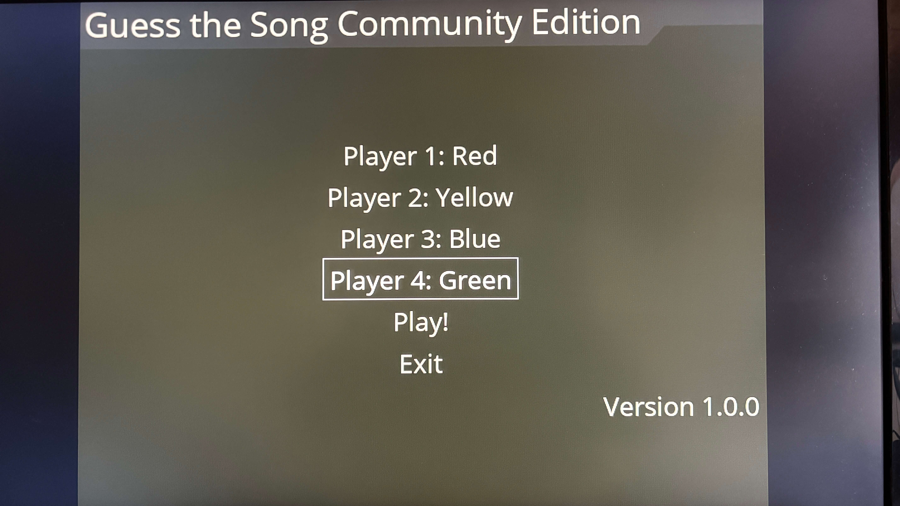
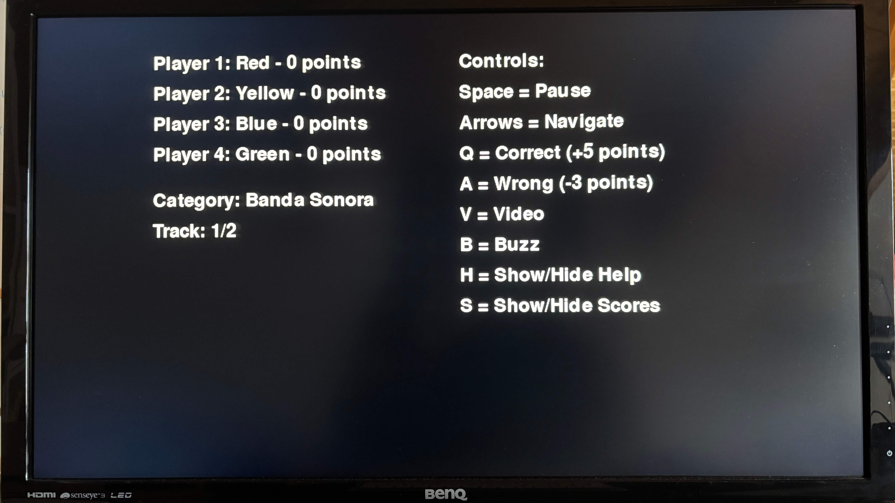
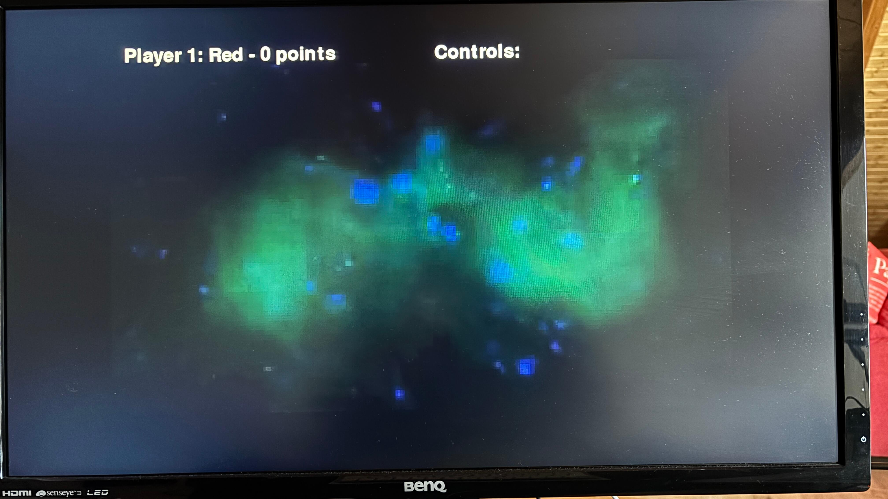
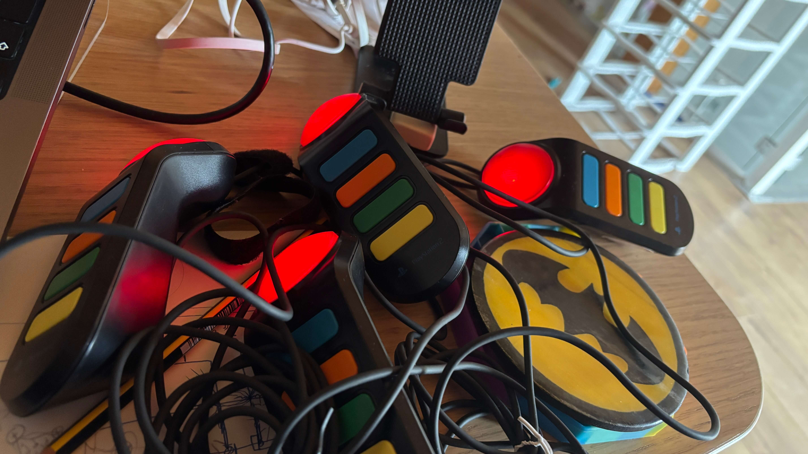

# Guess the Song Community Edition

A music quiz game where players must guess songs from different categories. You need 4 players/teams and a host/presenter of the show. Players only need to press the Red button on the Buzz Controller when they guess the song. The presenter must control all the mechanics of the show: Add/Sub points, play/pause videos/songs, etc.

## Screenshots

Check out some visuals of the game in action:






## Features

-   Buzz! controller support (up to 4 players).
-   Multi-language support (English and Spanish).
-   Audio and video playback.
-   Multiple song categories.

**NOTE:** This project is a work in progress and may contain bugs or incomplete features. Please report any issues you encounter. I was using AI for some code. I think that the code is not very clean, but it works. I'll try to improve it in the future. I appreciate any feedback on the code quality.

## Controls

### Navigation

-   `Up Arrow`: Next category
-   `Down Arrow`: Previous category
-   `Right Arrow`: Next song
-   `Left Arrow`: Previous song
-   `Space`: Resume song
-   `C`: Undo last action
-   `H`: Show/hide controls
-   `S`: Show scores
-   `V`: Play/stop video
-   `ESC`: Exit game
-   `Red Button`: Buzz! Controller Answer question
-   `Q`: Correct answer (+5 points) for the player who must respond
-   `A`: Wrong answer (-3 points) for the player who must respond

## Requirements

-   Python 3.x
-   pygame
-   pygame-menu
-   moviepy
-   hid (for Buzz! controller support)
-   uv (for package and environment management)
-   pytest (for testing)
-   ruff (for linting and formatting)
-   pynput (optional)

## Installation

1. Clone the repository
2. Install uv if you haven't already:

```bash
curl -LsSf https://astral.sh/uv/install.sh | sh
```

3. Create virtual environment and install dependencies:

```bash
make install
```

If you are using macOS, install these dependencies using brew:

```bash
brew install ffmpeg hidapi
```

4. Run the game:

```bash
make run # Run the game with default pack
make run --pack pack_02 # or any other pack directory name
make run-mac # Run the game for macOS and you have issues with hidapi not detecting the controller
```

5. To run the tests:

```bash
make test
```

## Adding Songs

To add songs to the game, check for example the `data/pack_01 folder`.

```json
{
    "categories": [
        {
            "name": "Category Name",
            "description": "Category Description",
            "songs": [
                {
                    "title": "Song Title",
                    "file": "path/to/audio/file",
                    "video": "path/to/video/file" or false
                }
            ]
        }
    ]
}
```

## TODO

-   [ ] Add more categories and songs.
-   [ ] Improve code quality and organization.
-   [ ] Add tests.
-   [ ] Add themes and customization options.
-   [ ] Enhance user interface and experience.
-   [ ] Add more game mechanics (e.g. keyboard support, time limits).

## Author & License

-   Jose Cerrejon (ulysess@gmail.com)
-   This project is under the MIT License
